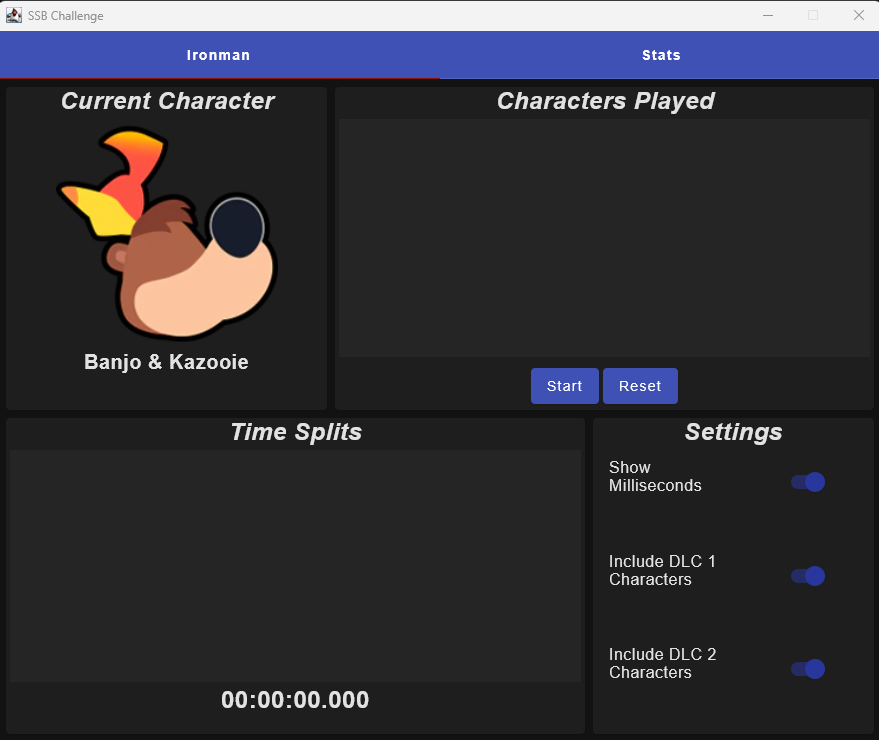
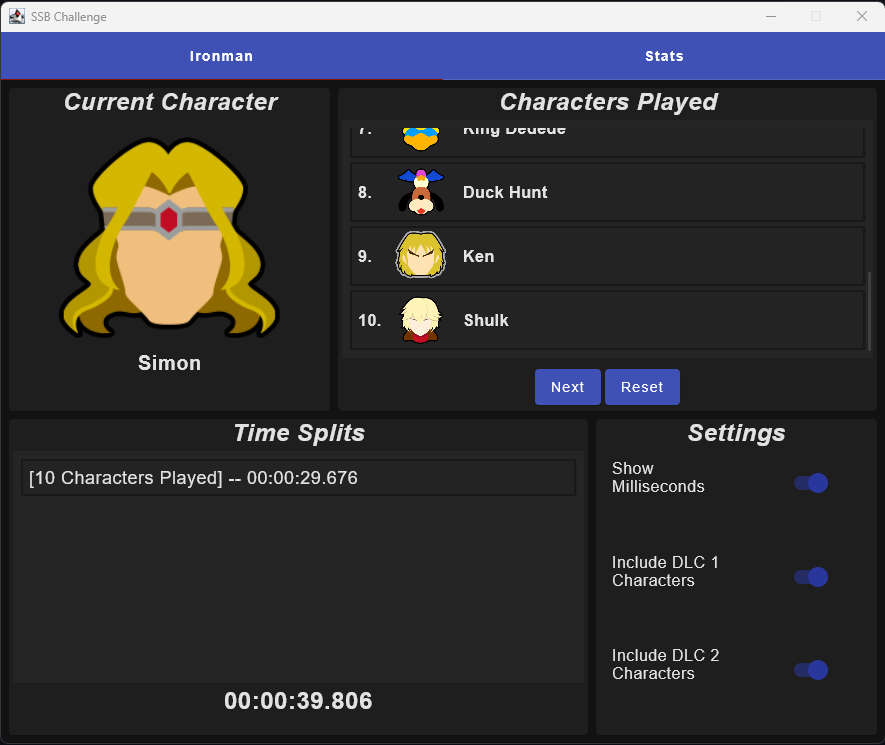
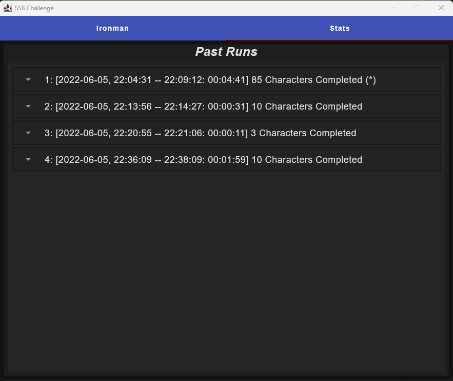
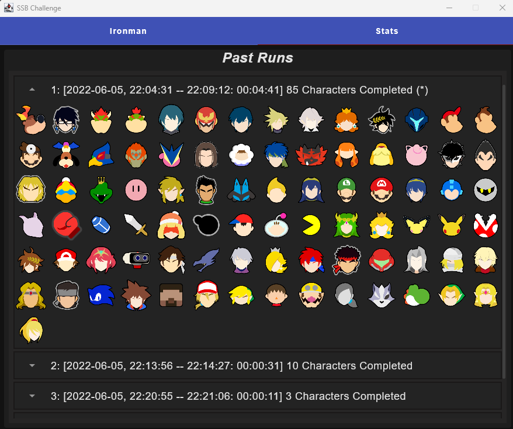

# Super Smash Brothers Challenge

## Description
Super Smash Brothers Challenge (SSBC for short) is a Desktop application written in
Kotlin using Jetpack Compose and Jetbrains Exposed. The app helps players with Ironman
challenges. It keeps track of progress, timing, automatically does time splits and 
past attempts. It is backed by a SQLITE db.

The main point of this application was to try out the Jetpack Compose UI library and
Jetbrains Exposed Database library.

## Use
This application is free to use by any who wants to use it. A link to this repo would
be greatly appreciated if you do decide to use it publicly though.

## Issues
As this was mainly an application for learning on my end I'm sure there might be issues
out there. If you find one go ahead and make an issue here on the repo. I'll try my
best to get to it in my free time.

## Screenshots

## Resources
The character logos I used for this application all came from https://www.ssbwiki.com/Category:Head_icons_(SSBU).
